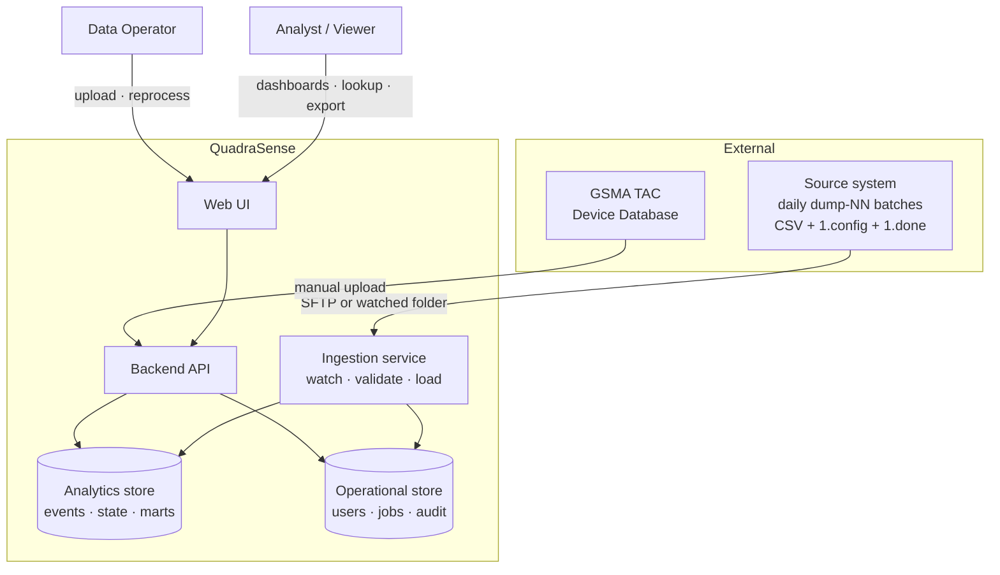
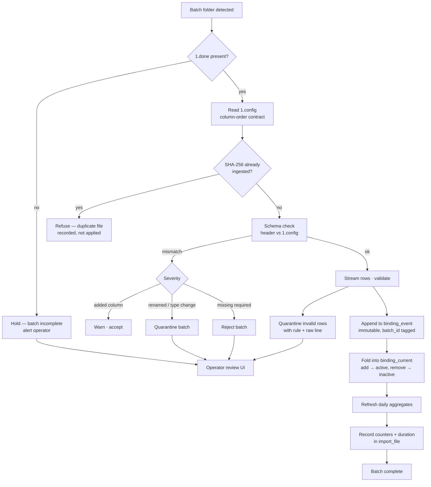

# Architecture Overview

**Status:** Draft — Phase 1. Engine choice pending benchmark (ADR-003).

---

## 1. Requirements summary

### Confirmed scope

| # | Requirement | Source |
|---|---|---|
| R1 | Device population analytics (manufacturer / brand / model / type / OS) | confirmed |
| R2 | Change and churn analytics, including manufacturer migration | confirmed |
| R3 | Subscriber-level lookup by MSISDN / IMSI / IMEI | confirmed |
| R4 | SIM-swap detection and reporting | confirmed |
| R5 | "Any other meaningful statistic the data supports" | confirmed |
| R6 | Upload centre for SQM files, with validation, preview, retry, history | brief |
| R7 | TAC management: upload, version, diff, rollback | brief |
| R8 | Data-quality dashboard and quarantine review | brief |
| R9 | Idempotent, reprocessable, fully audited import pipeline | brief |
| R10 | Raw identifiers displayed without masking | confirmed |
| R11 | Full event history retained indefinitely | confirmed |

### Measured scale

| Property | Value |
|---|---|
| Initial load | 125,939,523 bindings (4.86 GiB CSV) |
| Backfill available | 677,580,701 events (32.2 GiB, 82 days) |
| Daily volume | 8.26M events/day (min 6.6M, max 13.5M) |
| Current active state | ~108M bindings over ~73.3M MSISDNs |
| Growth | ~3.0B events/year |
| Reference data | 270,166 TACs |
| Tenancy | single operator (MCC/MNC 43211) |

### Non-functional targets

These are **proposed**, to be ratified once production hardware is known.

| Metric | Target |
|---|---|
| Dashboard widget (P95) | < 500 ms |
| Dashboard widget (P99) | < 1.5 s |
| Point lookup by MSISDN (P95) | < 100 ms |
| Heavy churn aggregation (P95) | < 10 s |
| Daily ingest window | < 30 min for 8.3M events |
| Initial backfill | < 8 h for 804M events |
| Export → background job threshold | > 100,000 rows |

### Explicit non-goals

- **No streaming / near-real-time.** The source delivers daily batches; nothing in the data justifies Kafka
  or a streaming engine. Revisit only if the delivery cadence changes.
- **No multi-tenancy in v1.** One operator. The schema carries an operator dimension so it is not painful
  to add later.
- **No horizontal scale-out in v1.** The measured volumes fit comfortably on one well-specified server.

---

## 2. System context

---

## 3. Ingestion data flow

The pipeline is the heart of the system. It is designed around three measured facts: the feed is
**set-semantic**, it is **order-dependent**, and it is **undated**.

### Why each guard exists

| Guard | Justification |
|---|---|
| `1.done` gate | the source's own completion sentinel; 1 of 6 observed batches lacked it |
| SHA-256 idempotency | the only reliable way to detect a re-sent file, since the data carries no date |
| `1.config` as contract | trusting the CSV header alone would miss a silent column reorder |
| Immutable event log first | makes reprocessing safe and the source files a genuine backup |
| Quarantine, not drop | 0.02% of rows are malformed; discarding them silently would hide a source regression |

### Ordering

Because the files carry no date, ingestion order is determined by `(batch_timestamp, filename)`. This ordering
was **independently validated**: the TAC allocation-date frontier advances monotonically across all 82 files
in this order. The resulting `seq` is stored per batch, alongside a nullable `data_date` to be backfilled
when real dates are obtained.

---

## 4. Component responsibilities

| Component | Responsibility | Explicitly not responsible for |
|---|---|---|
| Ingestion service | file discovery, validation, load, aggregate refresh, job state | serving queries |
| Analytics store | event history, current state, marts | auth, job state, audit |
| Operational store | users, roles, jobs, audit, dashboard definitions, vendor map | bulk analytics |
| Backend API | authz, query construction, pagination, export orchestration | business rules in route handlers |
| Web UI | presentation, filter state, virtualised tables | computing aggregates client-side |

Two stores is a deliberate choice, not an accident: the operational data is small, highly transactional, and
relational; the analytics data is enormous, append-heavy, and scan-oriented. Forcing both into one engine
means one of them is served badly. This is settled in ADR-002 / ADR-003.

---

## 5. Key risks

| # | Risk | Impact | Mitigation |
|---|---|---|---|
| RK1 | ~~Delta files carry no date~~ | — | **RESOLVED 2026-09-12.** Dated files supplied; the previously-inferred ordering proved exactly correct. See `docs/discovery/03-dated-daily-files.md`. |
| RK2 | ~~Suspected ~27-day gap after 2026-01-25~~ | — | **RULED OUT.** The first daily file is 2026-01-26, the day after the dump ends. 7 days are missing in May 2026 instead, and can be requested. |
| RK2b | **19.18% redundant adds no longer explained by a gap** | current state is approximate | Q1 (snapshot vs month-union) is now the sole remaining explanation and needs answering |
| RK3 | Initial dump is likely a month-union, not a snapshot | baseline state slightly overstated | binding state carries an `unknown-at-baseline` distinction rather than implying false precision |
| RK4 | 7% of IMEIs are `000000` | enrichment ceiling is 92.8% | modelled as an explicit category and tracked as a KPI |
| RK5 | Production hardware unknown | sizing unvalidated | benchmark establishes relative behaviour; targets re-checked on real hardware |
| RK6 | Source schema may change silently | corrupt analytics | `1.config` contract + schema-version detection with severity-based accept/warn/quarantine/reject |
| RK7 | Raw PII displayed unmasked | exposure if access control fails | masking built as a disabled config flag; export audit retained; RBAC from day one |
