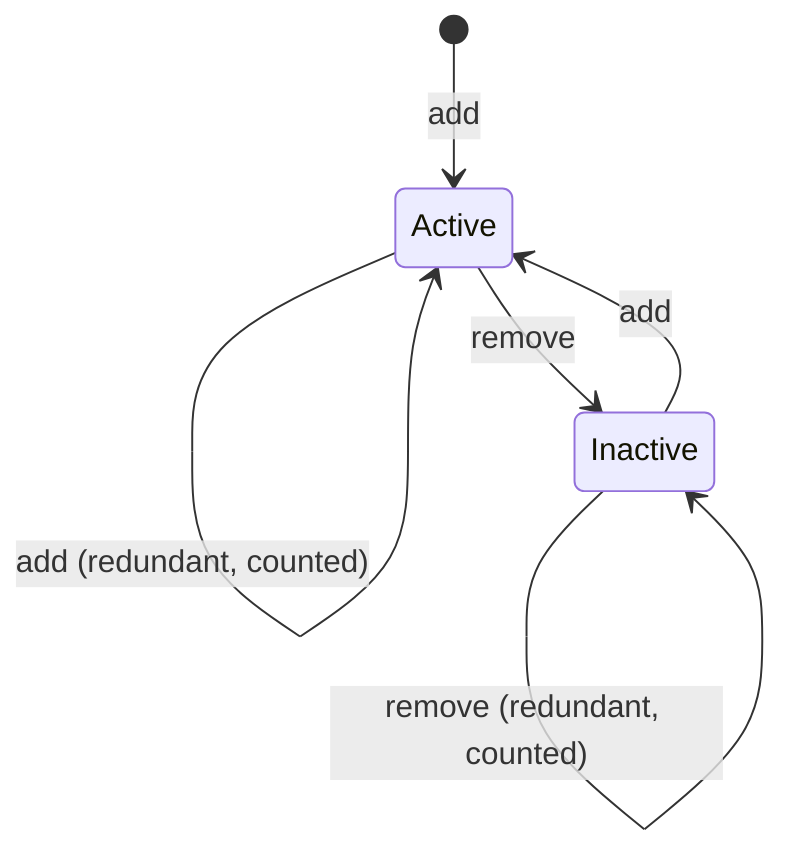
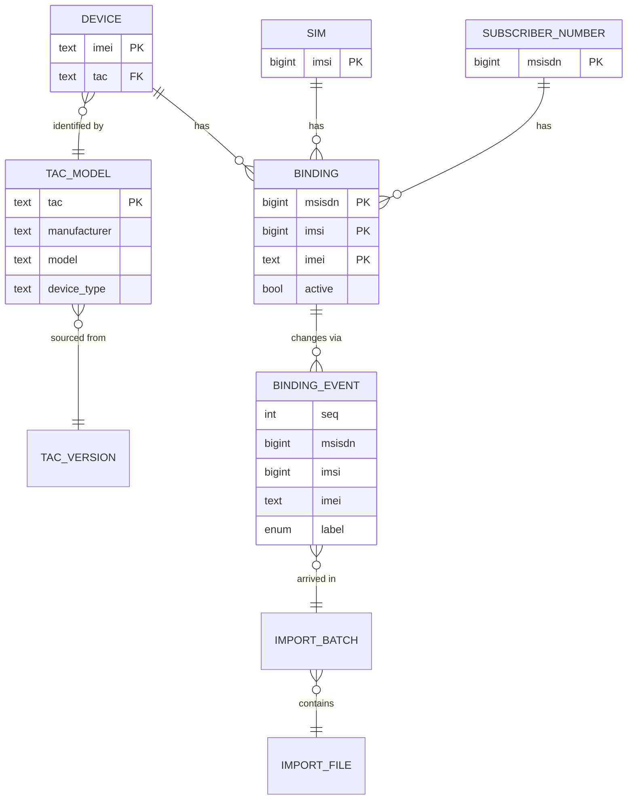
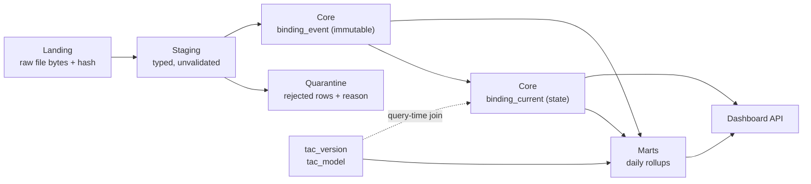

# Data Model

**Status:** Draft — engine-independent. Physical types and index/ordering choices are finalised in ADR-003.
**Derived from:** `docs/discovery/01-data-profiling-report.md` (all cardinalities below are measured).

---

## 1. The core concept: a *binding*

The source data does not describe subscribers, and it does not describe devices. It describes the
**relationship between a phone number, a SIM, and a handset**:

```
binding = (msisdn, imsi, imei)
```

This is the natural key — **0 duplicates across 125,939,523 rows**. Every design decision below follows from
taking this grain seriously rather than forcing the data into a "one row per subscriber" shape it does not have.

A binding has a lifecycle driven entirely by the `add` / `remove` feed:



The redundant transitions are not hypothetical — they are 19.18% and 1.77% of events respectively. They are
**recorded and counted, never treated as errors**, because the alternation test showed the feed is otherwise
perfectly well-formed (0 double-adds in 8,062,257 transitions).

---

## 2. Entity–relationship overview



Measured cardinalities (initial dump + 82 delta days):

| Relationship | Measurement |
|---|---|
| IMSI → MSISDN | **99.97% exactly 1:1** (79,465,454 / 79,490,189) |
| MSISDN → IMSI | 98.26% have 1 SIM; 1.74% changed SIM (**SIM swap**) |
| MSISDN → IMEI | 48.7% one device; **51.3% used 2+ devices** |
| IMEI → MSISDN | 73.2M single-use; 15.3M shared by 2+ numbers (**dual-SIM / resale**) |
| TAC → devices | 95,571 distinct TACs in data, of 270,166 known |

The near-1:1 IMSI↔MSISDN relationship is *not* modelled as an identity. The 1.74% that break it are exactly
the SIM-swap population the business wants to see, so collapsing them would destroy the signal.

---

## 3. Layered model



Three principles:

1. **`binding_event` is immutable and append-only.** It is the system of record. Everything else can be
   rebuilt from it plus the source files. This is what makes reprocessing safe and makes the source files a
   genuine backup.
2. **`binding_current` is derived state**, never edited by hand. It is a fold of `binding_event` over the
   initial snapshot.
3. **TAC is joined at query time, not baked in** (per ADR-004). At 270,166 rows the dimension is trivially
   small, so the join costs almost nothing, and corrections to the TAC file take effect everywhere at once
   without reprocessing hundreds of millions of rows.

---

## 4. Core tables

### 4.1 `binding_event` — the system of record

| Purpose | Immutable log of every add/remove ever received |
|---|---|
| Grain | one row per (binding, delivery) |
| Natural key | `(msisdn, imsi, imei, seq)` |
| Expected rows | 803.5M today, **+3.0B/year** |
| Access pattern | (1) full scans for churn analytics, (2) per-MSISDN history, (3) per-day aggregation |
| Retention | **indefinite** (confirmed) |
| Partitioning | by `seq` range / day bucket — aligns with both ingestion and time-range filters |
| Ordering | `(msisdn, imsi, imei, seq)` — serves the per-subscriber history lookup directly |

| Column | Type | Note |
|---|---|---|
| `seq` | int | Delivery sequence number. **Not a date** — see the note in §7 |
| `batch_id` | uuid | FK to `import_batch`; provenance for every row |
| `msisdn` | bigint | 10 digits, always numeric |
| `imsi` | bigint | 15 digits, always numeric |
| `imei` | text | **text, not integer** — `000000` and other short values carry leading zeros |
| `label` | enum | `add` / `remove` — domain verified over 677.6M rows |

`tac` is **derived**, not stored: `CASE WHEN length(imei) = 14 THEN substr(imei, 1, 8) END`. The length guard
is mandatory: 3.0% of delta IMEIs and 7.0% of initial-dump IMEIs are not 14 characters.

### 4.2 `binding_current` — derived state

| Purpose | The current active binding set; source for nearly every dashboard |
|---|---|
| Grain | one row per `(msisdn, imsi, imei)` |
| Primary key | `(msisdn, imsi, imei)` |
| Expected rows | **~108M active**, ~227M including inactive |
| Access pattern | aggregate scans with a TAC join; point lookup by msisdn / imei / imsi |
| Rebuild | fully reconstructable from `binding_event` |

| Column | Type | Note |
|---|---|---|
| `msisdn`, `imsi`, `imei` | as above | |
| `active` | bool | |
| `first_seen_seq` | int | |
| `last_change_seq` | int | drives "changed recently" queries |

Keeping inactive rows (rather than deleting) costs ~2× the storage and buys the churn analytics that were
confirmed in scope. Given ~108M active vs ~227M total, this is a deliberate and cheap trade.

### 4.3 `tac_model` and `tac_version` — the versioned dimension

| Purpose | GSMA device metadata, versioned so an old report can be reproduced |
|---|---|
| Grain | one row per `(tac_version_id, tac)` |
| Primary key | `(tac_version_id, tac)` |
| Expected rows | 270,166 per version |
| Retention | every version kept — it is tiny |

`tac` is **text**, never integer: leading zeros are significant (`00100100`).

`tac_version` records the uploaded file, its hash, row count, upload time, uploading user, and a diff summary
against the previous version (added / changed / removed TAC counts), which is what makes the rollback and
comparison features in the TAC management screen possible.

### 4.4 `tac_vendor_map` — curated normalisation

Measured need: the raw `manufacturer` field contains 10,529 distinct values, including 6 spellings of Samsung
and 7 of Motorola. `operatingSystem` has 555 raw values that normalise to 460 on case/whitespace alone.

| Column | Type | Note |
|---|---|---|
| `raw_manufacturer` | text PK | as it appears in the GSMA file |
| `vendor_canonical` | text | e.g. `Samsung` |
| `vendor_group` | text | e.g. `Samsung Electronics` |
| `updated_by`, `updated_at` | | editable in the UI, fully audited |

This is **data, not code**. Hardcoding a vendor mapping would mean a deployment every time a new manufacturer
string appears — and with 10,529 values and a long tail, that would happen constantly.

### 4.5 Operational tables

`import_batch`, `import_file`, `quarantine_row`, `audit_log`, `app_user`, `role`, `dashboard`, `widget`.

`import_file` carries the fields required for idempotency and for the import-history screen: file name, path,
**SHA-256 content hash**, byte size, row counts (received / valid / invalid / inserted / updated / duplicate /
rejected), timing, status, error detail, user, and the `1.config` / `1.done` sentinel state observed at ingest.

The **content hash is the idempotency key**: re-uploading a byte-identical file is detected and refused rather
than applied twice.

---

## 5. Aggregates (marts)

Dashboards must never scan the event log. Measured shape of the rollups:

| Mart | Grain | Est. rows/day | Purpose |
|---|---|---:|---|
| `agg_device_daily` | seq × tac × active | ~95,000 | manufacturer/model/OS/type widgets |
| `agg_change_daily` | seq × change_type × tac | ~95,000 | growth, churn, migration |
| `agg_quality_daily` | seq × rule | ~20 | the data-quality dashboard |

At ~95K rows/day a full year of rollups is ~35M rows — small enough that every trend widget is a
sub-100 ms query regardless of how much raw history accumulates behind it.

The TAC grain is safe to pre-aggregate on: measured skew is mild (largest single TAC = 0.24% of rows,
top 100 = 13.27%), so no skew mitigation is required.

---

## 6. Data-quality rules (all measured, with real rates)

| Rule | Severity | Measured rate | Action |
|---|---|---:|---|
| `imei = '000000'` | info | 6.97% initial / 2.96% delta | tag as **Unknown device**, keep |
| `length(imei) <> 14` (other) | warn | 0.025% / 0.020% | keep, flag, exclude from TAC join |
| `length(imsi) <> 15` | warn | 9 rows | quarantine |
| `length(msisdn) <> 10` | warn | 24 rows | quarantine |
| non-numeric identifier | error | **0 observed** | quarantine |
| `label` outside {add, remove} | error | **0 observed** | reject file |
| TAC not in GSMA DB | info | 0.20% of rows | tag **Unknown TAC**, keep |
| redundant `add` | info | 19.18% | count, no-op |
| orphan `remove` | info | 1.77% | count, no-op |
| duplicate file (hash match) | error | — | refuse batch |
| missing `1.done` | error | 1 of 6 batches | refuse batch |

Nothing here fails an import silently, and nothing legitimate is thrown away. The two large rates (`000000`
and redundant adds) are **characteristics of the feed, not defects** — which is precisely why they are
measured and displayed rather than "cleaned".

---

## 7. The unresolved dependency: `seq` vs. date

Every time-series structure above uses `seq` (delivery sequence), not a calendar date, because **the delta
files contain no date** and the ordering — though independently confirmed correct via the TAC
allocation-date frontier — cannot be converted to calendar dates from the data alone.

`import_batch` carries a nullable `data_date` column. The moment real dates are supplied (Q2), they are
backfilled into that column and every chart switches to a true calendar axis with **no schema migration**.
Until then the UI labels the axis honestly as delivery sequence.
