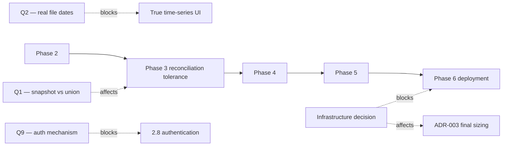

# Implementation Roadmap

**Status:** Draft — Phase 1. Sequencing assumes the analytics engine is settled by ADR-003.

The ordering principle: **prove the riskiest thing first**. The riskiest thing in this project is not the UI
or the API — it is whether the ingestion pipeline can correctly and repeatably fold 800M order-dependent,
undated events into a state that reconciles. Everything else is well-understood work.

---

## Phase 2 — Foundation

**Goal:** a developer can clone the repository and have the whole system running locally in one command.

| # | Deliverable | Done when |
|---|---|---|
| 2.1 | Repository structure, solution layout, `.gitignore`, `.env.example` | no secret can be committed; `.env.example` names every variable |
| 2.2 | `docker compose up` brings up analytics store, operational store, API, UI | one command, no manual steps |
| 2.3 | Database migrations, version-controlled | schema is reproducible from zero on a clean volume |
| 2.4 | Configuration and structured logging (request ID, correlation ID, job ID) | every log line is JSON and carries a correlation ID |
| 2.5 | Health / readiness / liveness endpoints | container orchestration can act on them |
| 2.6 | Test infrastructure: unit, integration with real containers | `dotnet test` runs green from a clean clone |
| 2.7 | CI: lint, type check, unit, integration, build, dependency scan | pipeline fails on high/critical vulnerabilities |
| 2.8 | Authentication foundation (roles, session, RBAC middleware) | an unauthenticated request cannot reach any data endpoint |

**Exit criterion:** a new developer is productive in under 30 minutes from `git clone`.

---

## Phase 3 — Data platform *(the critical phase)*

**Goal:** the pipeline reconciles against the numbers measured in discovery. This is where the project
succeeds or fails.

| # | Deliverable | Done when |
|---|---|---|
| 3.1 | Batch discovery + `1.done` gate + `1.config` contract | a batch without `1.done` is held, not ingested |
| 3.2 | SHA-256 idempotency | re-running the same file changes zero rows |
| 3.3 | Schema-change detection with severity grading | a renamed column quarantines; an appended column warns |
| 3.4 | Streaming validation + quarantine | the 33 known malformed rows land in quarantine with their rule and raw line |
| 3.5 | Initial dump importer (125,939,523 rows) | loads within the agreed window and row count matches exactly |
| 3.6 | Delta importer, order-aware (`seq`) | replaying all 82 days reproduces **~108M active bindings over ~73.3M MSISDNs** |
| 3.7 | Job tracking + progress + reprocess | operator can watch, cancel and re-run a batch from the UI |
| 3.8 | TAC importer with versioning and diff | added/changed/removed TAC counts shown; rollback works |
| 3.9 | Vendor normalisation map (editable, audited) | the 6 Samsung and 7 Motorola spellings collapse correctly |
| 3.10 | Aggregate/mart refresh | rollups match a direct query over raw events |
| 3.11 | Data-quality rule engine | measured rates reproduce: 6.97% `000000`, 19.18% redundant add, 1.77% orphan remove |

**Exit criterion — the reconciliation test.** Load the initial dump, replay all 82 delta days, and assert
against discovery's independently-measured figures:

| Assertion | Expected |
|---|---|
| Initial rows loaded | 125,939,523 |
| Delta events loaded | 677,580,701 |
| Active bindings after replay | ~108M (±1%) |
| Distinct active MSISDNs | ~73.3M (±1%) |
| TAC match rate | 92.8% |
| Redundant adds counted | 19.18% (±0.5) |
| Orphan removes counted | 1.77% (±0.2) |

If these do not reproduce, the pipeline is wrong and no amount of UI work matters. **This test gates Phase 4.**

Pipeline tests required (from the brief): duplicate processing, broken file, invalid schema, partial failure,
reprocessing, late data, empty file, very large file.

---

## Phase 4 — Application

**Goal:** the product.

| # | Deliverable |
|---|---|
| 4.1 | Design system: tokens, typography, spacing, the four async states |
| 4.2 | App shell: navigation, auth flow, error boundaries |
| 4.3 | Dashboard: KPI cards, time series, distributions, top-N |
| 4.4 | Global filters with URL state, shareable links |
| 4.5 | Virtualised server-paginated tables |
| 4.6 | Upload centre: drag & drop, progress, validation, preview, retry, history |
| 4.7 | Import history + job detail + reprocess |
| 4.8 | TAC management: upload, version compare, diff, rollback |
| 4.9 | Data-quality dashboard + quarantine review |
| 4.10 | Subscriber lookup (Analyst+, audited) |
| 4.11 | SIM-swap and device-change analytics |
| 4.12 | Export: sync for small results, background job above 100,000 rows |
| 4.13 | User / role administration |

**Deferred to v2 by explicit decision** (architecture accommodates them, v1 does not build them): add/remove/
resize/move widget, saved personal and shared dashboards, per-widget filters, cross-filtering, scheduled
reports, notifications.

Drill-down and global date/sequence range **are** in v1 — they are what makes the dashboard usable rather
than decorative.

---

## Phase 5 — Performance and hardening

| # | Deliverable |
|---|---|
| 5.1 | Benchmark every dashboard endpoint; record P50/P95/P99 |
| 5.2 | Query plan review for each mart query |
| 5.3 | Index/projection tuning driven by measurement, not intuition |
| 5.4 | Caching only where measurement justifies it |
| 5.5 | Load test at the confirmed concurrency |
| 5.6 | Failure testing: kill mid-import, disk full, corrupt file, engine restart |
| 5.7 | Security review against `04-security-model.md` |

**Exit criterion:** the performance budget in `01-overview.md` is met on production-representative hardware,
with evidence.

---

## Phase 6 — Production readiness

| # | Deliverable |
|---|---|
| 6.1 | Deployment artefacts and procedure |
| 6.2 | CI/CD to the target environment |
| 6.3 | Monitoring, metrics, alerting |
| 6.4 | Backup schedule and **verified restore drill** |
| 6.5 | Runbook: common failures and their remedies |
| 6.6 | Documentation set complete |

**Exit criterion:** a restore from backup has actually been performed and timed. A backup that has never been
restored is not a backup.

---

## Dependencies and blockers

**None of these block starting Phase 2.** Q9 is needed before 2.8 completes; Q1 affects only the tolerance of
the reconciliation assertion; Q2 affects the axis label, not the schema; the infrastructure decision is needed
by Phase 6.
