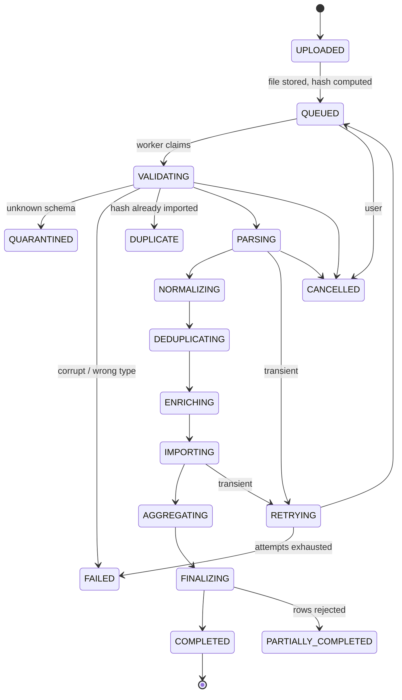

# Import Platform — Design

**Status:** Proposal. Sections marked **[ASK]** need a decision before implementation.
**Scope:** TAC and SQM imports, extensible to further sources.

---

## 1. Discovery — what is actually being imported

Two sources, and they have **fundamentally different semantics**. That difference drives every
decision below, so it is worth stating plainly before anything else.

| | **TAC** | **SQM daily** |
|---|---|---|
| Shape | Full snapshot of the whole GSMA device database | Delta: one day's changes |
| Rows | 270,166 | ~8.26M/day (min 6.6M, max 13.5M) |
| Size | 197 MiB | ~330–650 MB/day |
| Cadence | Occasional (monthly or less) | Daily |
| Business date | In the filename: `DeviceDatabase_TAC1Sep2026.csv` | In the filename: `..._2026-03-15.csv` |
| Date inside the file? | Yes — `lastUpdatedDate` per row | **No.** Filename only |
| Format | CSV, 26 cols, CRLF, RFC-4180 quoted | CSV, 4 cols, LF, unquoted |
| Natural key | `tac` — verified 0 duplicates | `(msisdn, imsi, imei)` — verified 0 duplicates |
| Replacing it means | Swap the whole lookup | Replace that one day |

**Measured change rate of TAC** (from `lastUpdatedDate`): roughly **1,000–1,650 rows change per
month** out of 270,166 — about 0.4–0.6%. So a diff between two versions is small, cheap to
compute, and genuinely informative.

Corroboration that the filename is a real version marker: the newest `lastUpdatedDate` in
`TAC1Sep2026` is **2026-08-31**. The file is what it says it is.

Two quirks worth carrying into validation:

- **341 rows have `lastUpdatedDate` earlier than `allocationDate`** (0.13%). Not fatal, but a
  referential rule worth reporting rather than ignoring.
- **`bandDetails` averages 540 characters and reaches 23,236.** Any row-level diff must hash
  rather than compare column-by-column in the application, or a 270K-row diff turns into
  gigabytes of string comparison.

### Volume, which is what makes a broker unnecessary

| | |
|---|---|
| SQM imports | ~1/day = **~365/year** |
| TAC imports | ~1/month = **~12/year** |
| Reprocesses | occasional |
| **Total jobs** | **< 500/year** |
| Concurrent jobs | 1–2 |
| Job duration | SQM ~3–6 min; TAC ~1–2 min |

Fewer than two jobs a day. Hold that number next to any queue technology being considered.

---

## 2. Versioning — five levels, five different meanings

The brief asked for versioning at file, dataset, schema, job and business-data level. They are
genuinely different things and conflating them is how import systems become unexplainable.

### 2.1 File version — *identity of bytes*

`sha256(content)`. Nothing else. Not the name, not the timestamp.

This is what answers "have we seen these exact bytes before". It is computed while streaming
the upload, before anything is parsed.

### 2.2 Schema version — *the column contract*

A named, registered shape. `TAC.v1` is the 26 GSMA columns in order; `SQM.v1` is
`msisdn,imsi,imei,label`.

A file is matched against the registered schemas by header. An unrecognised shape does **not**
get processed — see §7.

### 2.3 Import job version — *one attempt*

Every upload creates one `import_job` row with a monotonic ID. A reprocess creates a **new**
job that references the original via `reprocess_of_job_id`. History is never rewritten.

### 2.4 Dataset version — *a usable state of a source*

This is where TAC and SQM diverge sharply.

**TAC — snapshot versioning.** Each accepted file produces a `tac_version` with a lifecycle:

```
DRAFT → PROCESSING → READY → ACTIVE → SUPERSEDED
                         ↘ FAILED
```

Exactly one version is `ACTIVE`. Lookups resolve against the active version. Activation is a
separate, audited act — uploading does not change what the dashboard shows. **[ASK — §11 Q1]**

**SQM — business-date versioning.** The dataset is the event log. A "version" is a
`(business_date, revision)` pair. Revision 1 is the first accepted file for that date; a
corrected file for the same date becomes revision 2, and revision 2 replaces revision 1 (§6).

### 2.5 Business data version — *what the analytics actually see*

For TAC: the active `tac_version_id`.
For SQM: the set of currently-effective revisions, one per business date.

Every mart row records which import produced it, which is the lineage requirement (§10).

---

## 3. Worker and queue — recommendation

### The options, against fewer than 500 jobs a year

| Option | Pros | Cons | Verdict |
|---|---|---|---|
| **PostgreSQL queue** (`FOR UPDATE SKIP LOCKED`) | No new technology. Job state and audit record are the **same row**. Durable, queryable, transactional with the import metadata. Safe concurrency. | Polling rather than push; a few seconds of latency | **Chosen** |
| Hangfire / Quartz.NET | Mature, .NET-native, dashboard included | Own schema and conventions; we still need a custom state machine, progress and lineage, so most of it goes unused | Rejected — pays for a framework we would mostly bypass |
| Redis | On the team's skill list; fast | A second store for state that must not be lost. Redis durability is configurable and easy to get wrong; job state would live in two places and could diverge | Rejected |
| RabbitMQ | Proper broker semantics | An entire broker to move one message a day | Rejected |
| Kafka | Already running in the team's other stack | Built for millions of events/sec. Here: one message a day, and it cannot express "show me every import from last month with its row counts" without a second store | Rejected |

### Why PostgreSQL is not a compromise here

The decisive argument is not that a broker is overkill — though it is. It is that **the queue
and the import record are the same thing**.

The Import History UI has to show status, progress, row counts and errors. That data has to be
durable and queryable regardless of what the queue is. With a broker, the job exists in two
places and they can disagree: a message acknowledged but the database write lost, or vice
versa. With `SKIP LOCKED`, claiming a job and recording that it was claimed are one
transaction, and disagreement is not representable.

That is worth more here than push latency we do not need.

```sql
-- Claim one job. SKIP LOCKED lets N workers run without blocking each other -
-- except where days of one source are concerned, which are strictly serial.
UPDATE import_job SET status = 'RUNNING', worker_id = $1, lease_expires_at = now() + interval '5 minutes'
WHERE id = (
    SELECT id FROM import_job j
    WHERE status IN ('QUEUED', 'RETRYING') AND (run_after IS NULL OR run_after <= now())
      AND (j.business_date IS NULL OR NOT EXISTS (
              SELECT 1 FROM import_job earlier
               WHERE earlier.source_code = j.source_code
                 AND earlier.business_date < j.business_date
                 AND earlier.status NOT IN ('COMPLETED', 'PARTIALLY_COMPLETED')))
    ORDER BY priority DESC, business_date NULLS LAST, created_at
    FOR UPDATE SKIP LOCKED LIMIT 1
)
RETURNING *;
```

### Days of one source run in order, and that is a constraint

The `NOT EXISTS` above is not tidiness. It was added after it went wrong.

The fold is genuinely order-independent - it reads only one day's events, never reads current
state, and stamps each row with that day's sequence, so `ReplacingMergeTree` keeps the latest
whatever order the writes arrive in. That property was proven in Phase 0 and still holds.

**What is not order-independent is everything built _per delivery_.** Each dashboard mart is
"the state of the network at delivery N", aggregated from `binding_current` as it stands when
the mart runs. That is delivery N's state only while no other delivery has been folded around
it.

Two days proved it. 2026-06-16 and 2026-06-17 were both interrupted and retried; by the time
they ran again, 2026-06-18 had folded. Each rebuilt its own partition from a `binding_current`
that already contained 06-18, and all three deliveries ended up holding the identical figure of
**114,230,645 active bindings** - while the per-day change marts, which are partitioned by date
and cannot be affected by processing order, said 06-16 had **gained 167,111** bindings and its
own snapshot claimed a loss of 343,035.

`ORDER BY` alone could not have prevented that, and that is the point worth remembering:
`SKIP LOCKED` is doing its job when it steps over an earlier day held by another worker - or by
a worker that died still holding it - and takes the next one. Preference is not order.

Three things follow from the rule as written:

- **"Landed" means `COMPLETED` or `PARTIALLY_COMPLETED`** - the two states in which the day's
  events are in the analytics store. Everything else blocks.
- **A failed or cancelled day blocks the days after it**, deliberately. Running the next day over
  a hole produces a snapshot of a network that never existed, and nothing downstream would say
  so. Blocking is visible on the Import Center and has an exit: reprocess the day, or delete it.
- **Jobs with no business date neither block nor are blocked.** The initial dump describes a
  30-day range and the TAC snapshots describe no day at all; they are outside the ordering. A day
  the source never delivered has no job row, and so blocks nothing either - you cannot wait for
  something nobody queued.

The mart refresh carries the matching guard on the other side: it refuses to build a delivery's
snapshot at all if a later delivery is already folded, and publishes nothing to `mart_ready`.
Between them, a snapshot is either built from the right state or is not claimed to exist.

Checked by `ImportQueueTests`: a later day is not claimed while an earlier one is queued or
running, and a failed day blocks the days after it.

### A failed attempt must not block a day that has already landed

The rule above was first written as *"no earlier JOB that did not succeed"*, and that jammed the
real queue.

2026-07-11 failed as job 593 and was re-imported successfully as job 682 — `PARTIALLY_COMPLETED`
and `is_effective`. The **day** had landed; the failed **attempt** had not. So job 593 blocked
2026-07-12 through 2026-07-15 indefinitely, and nothing short of editing the row could have
released them: a reprocess adds a *new* job and leaves the old one exactly as it was.

The condition now asks the question that actually matters — is there an earlier day whose events
are not in the analytics store — by excluding any earlier job whose business date some other job
has landed. The original guarantee is unchanged and still tested: a day that has never imported
still blocks every day after it.

`A_failed_attempt_stops_blocking_once_that_day_lands_another_way` pins it, and was verified by
reverting the fix and watching it fail.

### Crash recovery — the lease

A running job holds a **lease** that the worker renews as it makes progress. If the worker dies,
the lease expires and a sweeper returns the job to `QUEUED` with its attempt count incremented.

Nothing is lost because nothing is in memory: the job's current stage and row cursor are
columns, so a resumed job restarts at its last completed stage rather than from the beginning.

### Concurrency

`ImportWorker:MaxConcurrency`, configured not hard-coded, defaulting to **2**. Two concurrent
8M-row imports already saturate a modest ClickHouse; more workers would make the database the
bottleneck and the queue depth would not improve.

---

## 4. Job state machine

One `status` column with an explicit enum. Not a scatter of booleans — `is_running` +
`is_failed` + `is_complete` admits states like "running and failed" that mean nothing.



`DUPLICATE` is a **terminal success-ish state**, not a failure: nothing was wrong, the work was
simply already done. Showing it as a failure would train operators to ignore red.

Transitions are enforced in one place, and an illegal transition throws rather than being
silently written.

---

## 5. Duplicate detection — four cases, four behaviours

| Case | Detection | Behaviour |
|---|---|---|
| Same name, same content | `sha256` already in `import_file` | **Refuse**, status `DUPLICATE`, link to the original import. No processing. |
| Different name, same content | `sha256` match | **Same** — the name is not the identity. Recorded with both names so it is explainable. |
| Same name, different content | Name match, hash differs | **Accept as a new version.** For SQM this becomes revision N+1 for that business date (§6). For TAC, a new `tac_version`. |
| Some rows already imported | Not detected at file level | Handled by the merge, not by rejection. SQM is idempotent per `(business_date, binding)`; TAC is idempotent per `tac`. Partial overlap is normal and harmless. |

The last row matters: chasing row-level duplicate detection across files would be expensive and
would also be **wrong**. The same binding legitimately appears on many days.

---

## 6. SQM corrections — replace by business date

A corrected file for a date that is already imported.

The strategies the brief listed, against what this data actually is:

| Strategy | Fit |
|---|---|
| Append | **Wrong.** Doubles that day's events. |
| Merge / Upsert | Wrong. The correction may *remove* a row the first file contained; an upsert cannot express a deletion. |
| Effective dating | Over-engineered. There is no need to query "what did we think yesterday". |
| **Replace by business date** | **Correct.** Each daily file is a complete, authoritative statement of that day's changes — not an increment on the previous file. |

So: mark the old revision superseded, delete that date's events, load the new file, re-fold.

### This is why partitioning should change

`binding_event` is currently partitioned **monthly**. The dominant maintenance operation is
"replace one day", and a monthly partition cannot express that — it would take out ~30
innocent days.

**Recommendation: partition `binding_event` by day.** Replacing a day becomes
`DROP PARTITION` plus a reload: atomic, instant, and with no mutation rewriting parts.

Cost: ~365 partitions/year against ClickHouse's comfortable limit in the low thousands. At
three years that is ~1,100, which is fine, and retention drops whole partitions anyway.

This reverses my earlier choice in migration 012. Monthly looked right for retention; daily is
right for corrections, and corrections are the operation that actually happens.

### Re-folding after a correction

> **SUPERSEDED (2026-09-24)** by the section below. This said a full re-fold was simplest and an
> incremental one should wait for a measurement. What was built is incremental - only the
> bindings the day touched - and it has now been measured.

The fold takes the last event per binding, so replacing day *N* only affects bindings whose
last event was on day *N*. A full re-fold is simplest and unconditionally correct; an
incremental one is possible and should only be attempted once the full one is measured.

### Late and corrected days - what happens, measured

Missing days arrive late, and corrected files replace days already loaded. Both must leave the
system exactly as if every day had arrived on time. What each derived store does:

| Store | Late or corrected day | Why it is right |
|---|---|---|
| `binding_event` | Loaded into its own date partition; a corrected day drops and replaces it | Keyed by date, not by arrival |
| `binding_current` | Every binding the day touched is re-derived from its **whole history, by date** | The last event by date decides; arrival order and sequence numbers do not |
| Day-level marts (`agg_change_daily`, `agg_change_summary_daily`, SIM and device change) | Rebuilt for that date only | Each reads only its own day's rows |
| Dashboard snapshot | Rebuilt for the delivery holding the **latest date** | The dashboard reads only that snapshot and the initial dump's |
| Snapshots of in-between deliveries | Left as they were | Never read. State as of an old date cannot be recovered from current state, so the refresh refuses to build one rather than label today's state with an old date |

**The history fold could not run at real scale.** Written as one statement, it built IN-sets
from every binding the day touched. On 2026-07-20 (6,503,281 bindings) it passed the fold's
1.2 GB cap after seven seconds - `MEMORY_LIMIT_EXCEEDED` in `CreatingSetsTransform` - and every
late or corrected day would have failed the same way, and a failed day blocks every day after
it. It now runs in msisdn ranges of about a million bindings. A binding's key begins with its
msisdn, so its whole history is inside one range and the cut is exact; the event log is sorted
by msisdn first, so the ranges together read it once.

Measured on the real event log, 2026-07-20, read-only:

| | |
|---|---:|
| Ranges | 7 |
| Time per range | 71 - 107 s |
| Peak memory per range | 513 - 745 MiB, against a 1.12 GiB cap |
| Rows read, all ranges | ~1.6 billion - the event log plus the dump, once |
| **Total** | **652 s** |
| Result against `binding_current` | **identical** for all 6,503,281 bindings (2,103,739 active, same fingerprint) |

`LateDayFoldTests` runs the real store against a scratch ClickHouse database: days in order, a
gap, the missing days arriving late and out of order, an add arriving a day after its remove, a
corrected day that drops a binding, then a normal day. It is checked against the plainest
possible truth - last event by date, else the dump - with ranges forced to two bindings and with
one range. With late days sent down the arrival-order path it fails.

**What a late day costs**, from `system.query_log` for 31 August and the measurement above:

| Step | Time |
|---|---:|
| Load the file | ~3 s |
| Fold: newest day (fast path) / late or corrected day (history) | 84 s / **~11 min** |
| Day-level marts | ~80 s |
| Dashboard snapshot: 14 full scans of `binding_current FINAL`, single-threaded | **~31 min** |

The snapshot is most of every import, and after a late day it rebuilds the same latest delivery
each time. While it runs, that delivery is withdrawn and the dashboard shows the one before it.

### One snapshot per run of files

So the snapshot is rebuilt **once per run**, not once per file (migration 011,
`DashboardSnapshot`):

- A file with more files of its source queued behind it skips the rebuild and records that the
  snapshot is owed (`imports.dashboard_refresh_owed`). Its data - events, current state, the
  day-level charts - is current as soon as it lands; only the snapshot waits.
- The last file of the run rebuilds it, and clears the debt it read **before** it began. A file
  that deferred while a rebuild ran moved `owed_since` forward, so that debt survives and is
  rebuilt for.
- A run can stop part way - a file fails and blocks the rest, or they are cancelled - and then no
  file is last. So the worker, whenever it has nothing it can claim, rebuilds any snapshot still
  owed, unless a job of that source is running in another worker. A failed rebuild stays owed and
  is tried again at the next idle moment. The dashboard cannot be left behind its data.
- Until the rebuild, the dashboard keeps the figures it had - it no longer falls back to an older
  delivery once per file - and the Data freshness card says the figures update once the queued
  files have landed.

For the ~27 files expected from the operator, estimated from the measured steps above: about
14 minutes a file (the history fold and the day-level marts) and one 31-minute rebuild at the
end - about 7 hours - against about 20 hours rebuilding after every file.

**Operationally:** a late or corrected day that fails blocks every later day, new daily files
included, until it is reprocessed or removed - by design, because folding past a hole produces a
state that never existed. It is visible in the Import Center.

---

## 7. Validation — three layers

**File level:** extension and declared MIME are advisory only; the file is validated by
*parsing* it. Checked: non-empty, decodable (the data is pure ASCII — verified), line ending,
delimiter, size ceiling, and that the first bytes are not a container format masquerading as
CSV.

**Schema level:** header matched against registered schema versions.

| Change | Severity | Action |
|---|---|---|
| Exact match | — | proceed |
| Column added at end | low | accept, warn, record as schema `v1+` |
| Column reordered | medium | accept only if a sidecar declares it (SQM ships `1.config`); else quarantine |
| Column renamed | high | **quarantine**, needs a human |
| Column missing | critical | **reject** |
| Unrecognised shape | critical | **quarantine**, never silently process |

**Row level:** the rules already measured in Phase 0, with their real rates — `000000` IMEI at
6.97%, malformed IMEI at 0.02%, and so on (see `03-data-model.md` §6). Invalid rows are
quarantined with column, value, row number and rule.

**Set level:** properties no single row can violate on its own. A TAC export where every record
is individually well-formed can still be unusable, because the key has to be unique across the
whole file — see **D10**, which is where this layer was added and why.

**Quarantine must not explode.** A wholly malformed 8M-row file would otherwise write 8M error
rows. Errors are therefore **aggregated by (rule, column)** with a capped sample of raw rows —
default 100 per rule — and a count. A file exceeding a configurable invalid-row ratio is failed
outright rather than quarantined row by row.

---

## 8. Transactions and staging

No single transaction over millions of rows. ClickHouse has no such transaction anyway, and in
PostgreSQL it would hold locks for minutes.

**SQM:** rows stream into a per-import staging table, are validated and counted, and only then
move into `binding_event`. With daily partitions the final step is a partition swap rather than
a row-by-row copy. On failure the staging table is dropped and production is untouched.

**TAC:** the new version lands in `tac_version_data` under its own `version_id` — it is never
written over the active version. The diff is computed between version rows. Activation is a
pointer change, which is what makes rollback possible without re-uploading (§9).

---

## 9. TAC diff, activation and rollback

Diff by **row hash**: `sha256` of the normalised column values, stored per row at load. Two
versions then diff by comparing hashes on the `tac` key — no wide string comparison, which
matters when `bandDetails` reaches 23 KB.

```
Previous  v2026.08.01
New       v2026.09.01
Added      3,214
Updated      532
Removed       18
Unchanged 248,901
```

Expected real magnitude, from the measured churn: **~1,000–1,650 changes per month**. A diff
showing 50,000 changes would itself be a signal worth stopping on.

**Rollback** re-points the active version at a previous one. No re-upload, because every version's
rows are retained. Both activation and rollback are audited with user, time and reason.

---

## 10. Lineage, freshness and monitoring

Every mart row carries the `import_job_id` that produced it, so "where did this number come
from" resolves to file → hash → import → version → time.

**Data freshness** — called out as important — becomes a first-class dashboard widget:

- latest SQM business date loaded, and its **age in days**
- latest and active TAC version
- missing business dates in the expected range (7 are already known)
- failed or stuck imports

Freshness is computed from `max(business_date)`, not from upload time. Those differ: the
existing files were delivered roughly **four weeks behind** the data they describe, so upload
recency would have overstated freshness badly.

**Worker metrics:** queue depth, running jobs, failures, retries, rows/sec, oldest pending job,
lease expiries.

| Alert | Threshold |
|---|---|
| No SQM import | > 48 h since last completed |
| Missing business date | any gap in the expected range |
| Import failed | any |
| Job stuck | lease expired twice |
| Quarantine ratio | > 1% of rows in a file |
| TAC diff unusually large | > 5,000 changes |

---

## 11. Decisions

All four open questions were answered on 2026-09-13, each as recommended.

### D1 — TAC activation: **manual**

An uploaded TAC file is validated, processed and diffed, and then stops at `READY`. The
production mapping does not change until an administrator activates it.

The reasoning: TAC determines the manufacturer and model shown on every screen in the product.
A bad source file that activates itself is wrong everywhere at once, and the review it replaces
costs one click a month against a measured change rate of 1,000-1,650 rows.

### D2 — Storage: **a directory on the server**

Original files are written to a configured directory, outside the web root, never served
directly. The database holds metadata and a reference only.

MinIO was the alternative and is already running in the environment, but object storage earns
its keep when compute and storage are separate or when many services need the same blobs.
Here one worker reads files on the machine they landed on. It stays behind an
`IImportFileStore` interface, so moving to object storage later is an implementation swap
rather than a rewrite.

### D3 — Retention: **keep originals indefinitely**

~144 GB/year, and the files are the ultimate backup: every table in the system is rebuildable
from them plus the pipeline. Deleting them would convert a recoverable mistake into an
unrecoverable one for the sake of disk that costs less than the recovery would.

Retention remains a configuration value rather than an assumption baked into code.

### D4 — Permissions: **Operator imports, Administrator activates**

| Action | Viewer | Analyst | Data Operator | Administrator |
|---|---|---|---|---|
| View import history | - | yes | yes | yes |
| Upload / import | - | - | **yes** | yes |
| Cancel / reprocess | - | - | **yes** | yes |
| **Activate or roll back a TAC version** | - | - | - | **yes** |
| Delete an import record | - | - | - | yes |

Activation is separated from import for the same reason it is manual: it is the only action
here that changes what every user sees.

---

## 12. What was built, and what the build changed

The design above survived implementation mostly intact. Four things did not, and each was
changed for a measured reason rather than a preference.

### D5 — The fold is incremental, not a replay

The design said current state is rebuilt by folding the event log. That is what the backfill
does, and on the real data it takes **about 45 minutes**, in sixteen chunks, because an
aggregate over 1.05 billion rows grouping into ~227 million bindings does not fit in the
development machine's memory. Two attempts failed before the chunked one worked:

| Attempt | Settings | Result |
|---|---|---|
| 1 | `optimize_aggregation_in_order=1`, 2.5 GB ceiling | `MEMORY_LIMIT_EXCEEDED` at 2.33 GiB. Aggregation-in-order **disables** spill-to-disk, so the hash table grew unbounded. |
| 2 | external aggregation, 3 GB ceiling, 900 MB spill | Spilled correctly, then exceeded the ceiling in the **merge** phase. |
| 3 | sixteen MSISDN ranges, 2.2 GB ceiling | Worked. `msisdn` leads the sort key, so a range predicate prunes through the primary index and the sixteen chunks cost one full scan between them. |

A daily import does not do any of that. It folds **only the new day**:

```sql
INSERT INTO binding_current
SELECT msisdn, imsi, imei, argMax(label, seq) = 'add', max(seq), argMax(data_date, seq)
FROM binding_event WHERE data_date = ? GROUP BY msisdn, imsi, imei
```

This is correct because `binding_current` is a `ReplacingMergeTree` versioned by
`last_change_seq`: the new day carries the highest sequence, so its row wins on merge over
anything written before it. Nothing is deleted, nothing is replayed.

It rests entirely on the set semantics proven in Phase 0 — a binding's final state is decided
by its last event alone, verified over 8,062,257 transitions with zero double-adds. Without
that proof, the incremental fold would be unsound and the 45-minute replay would be the only
correct option. This is the clearest case in the project of a discovery measurement paying for
itself in architecture.

### D6 — Daily partitioning, now required rather than recommended

Section 6 argued for it. It is now a hard dependency: `RemoveDayAsync` is implemented as
`DROP PARTITION`, which on a monthly-partitioned table would remove a whole month. The worker
therefore **checks the partition key at startup and refuses to run** if it is wrong, rather
than discovering it when a corrected file for one day silently deletes the other thirty
(`015_daily_partitioning.sql`).

### D7 — Validation reads the file twice, and the second read has two forms

A single pass would mean either writing rows before knowing the file is sound, or parsing
eight million rows into the worker so they can be inspected and re-serialised. So the file is
read twice: once to validate and count, once to load.

The second read has two forms, and the first decides which:

* **No rejected rows** — the common case, and the case for every file delivered so far — the
  file is copied to the socket verbatim, at disk speed.
* **Some rejected rows** the worker writes the CSV itself, line by line, through a pipe, so
  the good rows from a partly-bad file can still be imported. Slower, and only paid when it
  buys something.

The accept/warn/reject split follows the measured data, not a convention. `000000` is the
source's unknown-device sentinel on 8,776,237 bindings and is **accepted silently**; 31,209
bindings carry an IMEI that is neither 14 digits nor the sentinel and are **imported with a
warning**; only a non-numeric MSISDN or IMSI is **rejected**, because those columns are UInt64
in the analytics store and such a row cannot be represented at all.

A file where more than 5% of rows are rejected is quarantined whole rather than partly
imported. That usually means the format changed or the wrong file was sent, and importing the
remainder would produce a day that looks complete and is not.

### D8 — TAC versions live in one table behind a view

`sqm.tac` is now a view onto whichever version `sqm.tac_active` names, with every version in
`sqm.tac_all` partitioned by `version_id`. Three consequences, all of which the activation
workflow needs:

* Activation is a one-row insert. It is instant and atomic from a reader's point of view.
* Rollback is activation pointed at an earlier version — the same operation, no special path.
* A failed load is undone by dropping its own partition, which cannot touch a version that is
  fine.

Every existing query against `sqm.tac` kept working unchanged.

Activation crosses two databases with no transaction spanning them, so the order is chosen for
which failure is survivable: **PostgreSQL commits first**, then the analytics store switches.
If the switch fails, the operational record is reverted and the caller is told plainly that
nothing changed. The opposite order would change the manufacturer shown on every screen before
anything recorded that it had happened.

**Activation owes the dashboard a rebuild** (product owner's decision, 2026-10-06). Lookups and
the Explorer read `sqm.tac` live and switch at once, but the dashboard marts resolved TACs when
they were built, so until they are rebuilt they keep the previous version's manufacturers and
models. Once both stores have switched, `TacEndpoints` records the `SQM` snapshot as owed — the
same debt a deferred daily file leaves (§6, "One snapshot per run of files") — rather than starting a rebuild
inside the request: the rebuild is about 30 minutes of scans, and the worker settles any owed
snapshot as soon as it has nothing else it can claim. A rollback goes through the same route and
owes the same rebuild. The administrator is told the dashboard follows "as soon as the import
worker is idle - about half an hour". Covered by `TacActivationEndpointTests`; removing the call
fails them.

### D9 — A delivery is served only once its marts are complete

Every dashboard query used to select its delivery with
`WHERE seq = (SELECT max(seq) FROM <mart>)`. That is correct only if the newest sequence present
is also finished — and the refresh writes **fifteen INSERTs across six marts**: three measures
into the device-class mart, three into the capability mart, six dimensions into the dimension
mart.

A run where a third of them failed still left the new sequence present in every mart. So
`max(seq)` selected the half-built delivery, and the widgets whose slice had failed returned
nothing. Not an error, not a fallback to the previous good delivery — an empty chart on a screen
that had been working a minute earlier.

Observed exactly that: `agg_device_class_daily` holding only the subscribers measure,
`agg_capability_daily` only bindings, and the dimension mart missing `vendor`, which is the one
Top Vendors reads. Every partition existed. Checking that a partition exists is a much weaker
statement than it sounds.

`sqm.mart_ready` makes completion a fact the refresh **records** rather than something inferred
from rows existing. A sequence is withdrawn when its rebuild starts and published only when every
statement has succeeded, so the dashboard always reads the newest delivery that is actually
whole. During a rebuild it serves the previous one — a day older, internally consistent, and the
freshness card says how old it is.

This is the analytics-store twin of `imports.import_job.is_effective`: in both halves of the
system, **the newest thing that exists is not necessarily the thing to serve.**

`--verify-marts` checks the same property from the outside — every expected slice present, and
the totals reconciling against the KPI mart's active-binding count. A mart that disagrees with
the headline figure is worse than a missing one, because it will be believed.

### What the platform is made of

| Piece | Where |
|---|---|
| Operational schema | `db/operational/migrations/001`, `002` |
| Analytics schema | `db/analytics/migrations/014` (TAC versioning), `015` (daily partitioning) |
| Migration runner | `backend/src/Sqm.Migrator` |
| Job store and queue | `backend/src/Sqm.Infrastructure/DataImport/PostgresImportJobRepository*.cs` |
| File store | `.../DirectoryImportFileStore.cs` |
| Analytics writes | `.../ClickHouseIngestionStore.cs`, `.../ClickHouseTacVersionStore.cs` |
| Worker | `backend/src/Sqm.Ingestion` |
| API | `backend/src/Sqm.Api/Endpoints/ImportEndpoints.cs`, `TacEndpoints.cs` |
| Import Center | `frontend/src/features/imports` |
| Freshness on the dashboard | `frontend/src/features/dashboard/DataFreshnessCard.vue` |
| Backfill of the pre-platform load | `db/operational/jobs/backfill_bulk_load_history.py` |

### Three guarantees the database enforces, not the application

```sql
CREATE UNIQUE INDEX ux_import_file_sha ON imports.import_file (source_code, sha256);
CREATE UNIQUE INDEX ux_import_job_effective ON imports.import_job (source_code, business_date)
    WHERE is_effective;
CREATE UNIQUE INDEX ux_tac_version_active ON imports.tac_version ((status = 'ACTIVE'))
    WHERE status = 'ACTIVE';
```

Each replaces a check that a race could defeat. Two concurrent uploads of the same file both
pass an application-level existence check; only one can win an index.

### D10 — A TAC export is checked for structure before it is loaded, not after

`DeviceDatabase_TAC16Sep2026.csv` (349 MB) failed three attempts with:

```
Code: 27. DB::Exception: Cannot parse input: expected ',' before:
'\n35500510,Samsung Korea,SM-A905F,Galaxy A90,...': (at row 113551)
```

True, and useless. It names one line in 482,048 and gives an operator no way to tell a typo from
a ruined download. Diagnosing it took a separate pass with a real CSV parser, which found two
independent defects:

| | |
|---|---:|
| logical records | 482,047 |
| records with bytes missing | **27** |
| distinct TACs | 270,885 |
| TACs present exactly twice | **211,135** |
| records that are repeats | 211,135 (43.8%) |

The repetition is structured, not random: after a clean run of 50,949 records the file alternates
between blocks of roughly 165 new records and blocks of roughly 165 replayed from about five
blocks earlier — **1,224 such pairs**, which is why an otherwise ascending file steps backwards
1,234 times. All 211,135 duplicate pairs are byte-identical. Only 3 of the 27 damaged records sit
near a block boundary, so the two defects are independent. Lost bytes plus wholesale repetition
is a damaged transfer, not a bad export: a re-issued export changes content, it does not repeat it.

**Both rules already existed, and neither was usable.** Duplicate TACs were caught *after* the
load, so a doomed file was read, parsed and stored before being discarded. Malformed records were
caught by ClickHouse's parser, which stops at the first one. So the scan moved in front of the
load — the pattern the daily file has always used (D7): validate and count without writing, then
stream the bytes.

It is deliberately not a line splitter. `bandDetails` holds up to 5,335 characters of
comma-separated radio bands inside quotes, so splitting on commas would call almost every record
malformed. **The scanner's own first version got this wrong in the opposite direction:** it
treated any `"` as opening a quoted field, and the 19 records ending in a single stray quote made
it swallow the rest of the file — one "record" of 296,302 fields, 183,187 records counted where
there are 482,047. RFC 4180 opens a quoted field only at the *start* of a field. The corrected
scanner reproduces the Python reference parse exactly, on all seven figures above, in 10.8 s.

Why this matters more than the parse error suggests: the quiet case is a duplicated export whose
CSV is *clean*. It would load without complaint, and every count joining to `sqm.tac` would
double. This project has shipped that shape of bug once — 251,879,046 against a real
125,939,523 — and it was found by disbelieving a dashboard, not by an error.

Memory is a fixed 25 MB regardless of input: two bitmaps over the eight-digit TAC domain rather
than a hash set, because a hash set is sized by the input and the input is the thing under
suspicion.

**The damage turned out to be structural, not lossy, and the file was recovered.** Measured
before anything was rebuilt: all 211,135 repeated TACs carry byte-identical records; all 27
malformed fragments are the *tail* of a complete record that also survives in the file, so they
are debris from the replay seams rather than truncated devices; and the recovered set is a strict
superset of the active version - **0** of its 270,166 TACs go missing, and 719 are added, which
matches the measured change rate of 1,000-1,650 a month. `tools/repair_tac_transfer.py` rebuilds
the file from its own surviving lines and **refuses to write anything** unless both of those
properties hold, because a repeat with differing content is a conflict it has no business
resolving and a fragment with no intact counterpart is a model it would silently delete. Both
refusals are exercised, not assumed. The result - 270,885 records, 270,885 distinct TACs - is
certified by the platform's own scanner rather than by the script: clean, no faults, no rejection.
Repair is a tool a person runs, deliberately not a step the importer takes, because an importer
that quietly repairs its input is one that quietly accepts corruption nobody measured.

**The first refusal in production was itself unreadable.** Every failure summary was clipped to
500 characters, the rejection runs to 837, and the sentence saying the file was a damaged transfer
and should be downloaded again was the last one - so the stored message ended `...it is the key
manufacturer, model an` and the only actionable line was the only line nobody saw. Three fixes:
a rejection authored for an operator now keeps 2,000 characters where an incidental driver message
still keeps 500; a clip lands on a word boundary and marks itself `[...]`; and the remedy leads the
message instead of trailing it. The timeline said `No attempts remain` on attempt 1 of 3 for the
same reason it says it after attempt 3, which is a contradiction on screen - a permanently rejected
file now says so instead.

---

## 13. Still open

**A second TAC file.** One sound file exists (`DeviceDatabase_TAC1Sep2026.csv`, 270,166 records,
270,166 distinct TACs, scanned clean). A second arrived — `DeviceDatabase_TAC16Sep2026.csv` — and
is a damaged transfer (D10), so it was refused and the diff and activation flow still have not
been verified against two real versions. Worth obtaining a sound second file before the feature
is considered done.

**Delivery lag.** The observed files arrived roughly four weeks behind the data they describe.
That figure drives the freshness alert thresholds in §10, which are currently set from a single
observation.
